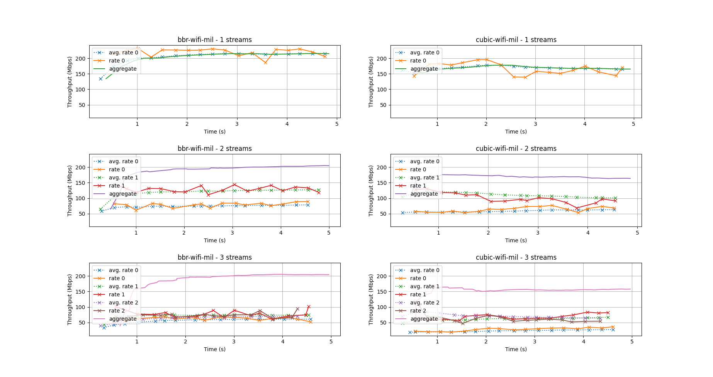

# Measurements Swiss Army Knife

Prototype client/server implementation of a multi-stream [ndt7](https://github.com/m-lab/ndt-server/blob/master/spec/ndt7-protocol.md) test.

The goal is to provide an implementation of ndt7 (client and server) fully compliant with the specification, including optional fields. Then, extend the specification as needed to support measuring the network with multiple TCP flows and aggregate the results.

The data format is currently compatible with ndt-server (you can use msak-client to measure against ndt-server, even if some advanced features may not work) but there is no guarantee that this won't change in the near future.

## Running the server

```bash
$ go build ./cmd/msak-server
$ ./msak-server
```

This will start listening for incoming connections on port 8080. To listen on a different ip/port, pass `-listen <ip>:<port>`.

## Running the client

```bash
$ go build ./cmd/msak-client
$ ./msak-client -server <ip>:<port>
```

This will run 3 download measurements with an increasing number of streams (1 to 3).

Command-line arguments:

- `-cc (bbr|cubic)`: request a specific congestion control algorithm from the server. Defaults to 'bbr'.
- `-streams`: the number of streams to use. If not specified, runs 3 measurements with 1/2/3 streams.
- `-duration`: duration of the measurement after the last stream has started.
- `-delay`: delay before starting the next stream.
- `-output`: output folder prefix

## Plotting the results

This repository includes a Python3 script to plot the results from one or two msak output folders on a 2x3 grid.

```bash
$ pip3 install -r requirements.txt
$ python3 plot.py <output_folder_1> <output_folder_2>
```

