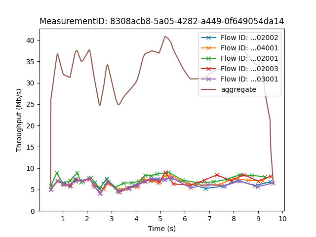

# Measurements Swiss Army Knife

Prototype client/server implementation of a multi-stream [ndt7](https://github.com/m-lab/ndt-server/blob/master/spec/ndt7-protocol.md) test ("ndt-m").

In addition to ndt7, msak provides:

- Multi-stream download and upload throughput measurements
- Client-side congestion control algorithm selection (cubic or bbr)

The ndt-m data format is not intended to be compatible with ndt7 clients and servers.

## Running the server

```bash
go build ./cmd/msak-server
./msak-server
```

This will start listening for incoming connections on port 8080. To listen on a different ip/port, pass `-listen <ip>:<port>`.

To get additional debug output, pass `-debug=true`.

## Running the client

```bash
go build ./cmd/msak-client
./msak-client
```

This will request a server from M-Lab's Locate service and run a download measurement with the default number of streams.

## Plotting the results

This repository includes a Python3 script to plot the results of a single measurement (individual TCP flows throughput and aggregate throughput). To install its dependencies:

```bash
pip3 install -r requirements.txt
```

To use it: first, when running a measurement with msak-client you must set the `-output` flag so that measurement data is saved somewhere. Then, get `MeasurementID` from any of the output files.

Once you know `MeasurementID`:

```bash
python3 plot.py <output folder> <measurement ID>
```

